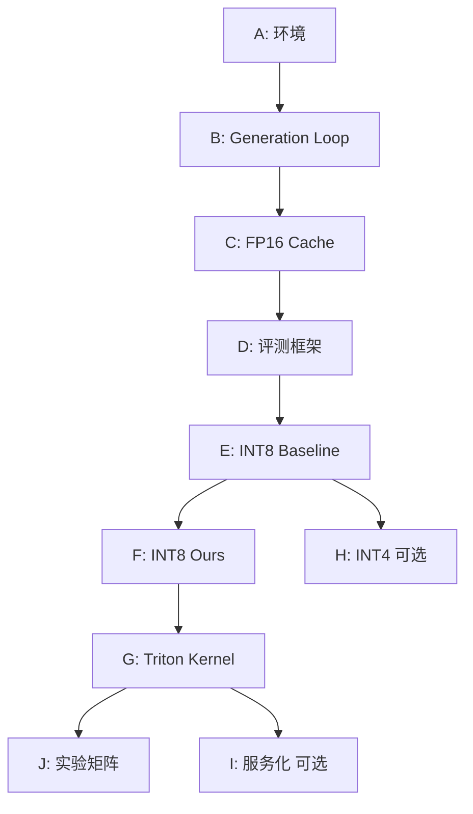

# KV Cache 量化项目 - 里程碑推进工作流

专门用于按里程碑顺序推进项目。

---

## 里程碑总览

| Milestone | 目标 | 关键产出 |
|-----------|------|----------|
| A | 环境 + Smoke Test | smoke_test.py, env/ |
| B | 自定义 Generation Loop | generate_loop.py |
| C | FP16 KV Cache | fp16_cache.py |
| D | 评测框架 | profile_*.py, eval_*.py |
| E | INT8 Baseline | int8_basic.py, int8_cache.py |
| F | INT8 Ours (KL校准) | calibrate_behavior.py, groupwise.py |
| G | Triton Kernel | triton_decode_attn_int8.py |
| H | INT4/Mixed (可选) | - |
| I | 服务化 (可选) | app.py, load_test.py |
| J | 实验矩阵 + 出图 | run_experiments.py, make_plots.py |

---

## 里程碑推进流程

// turbo
### Step 1: 确认当前进度
```bash
# 检查 lang.md 中的进度
cat lang.md | grep -A 50 "进度追踪"

# 确认已完成和进行中的 Milestone
```

### Step 2: 选择下一个任务
```
1. 找到第一个未完成的 Milestone
2. 确认该 Milestone 的前置依赖已完成
3. 选择该 Milestone 的第一个未完成子任务
```

// turbo
### Step 3: 查看验收标准
```bash
# 从 AGENT_TASKLIST.md 获取验收标准
cat AGENT_TASKLIST.md | grep -A 20 "Milestone <X>"
```

// turbo
### Step 4: 执行子任务
```
按照 /auto-dev workflow 执行：
1. 需求分析
2. 接口对齐
3. 代码实现
4. 质量检查
5. 测试验证
6. 记录更新
```

// turbo
### Step 5: 验收检查
```bash
# 运行里程碑验收命令
# A: python scripts/smoke_test.py
# B: 比较输出与 model.generate
# C: 检查 cache 长度 invariant
# D: 检查 CSV schema
# E: kv_mode=int8_baseline 端到端
# F: needle/PPL 趋势不劣于 baseline
# G: Triton kernel 数值对齐 + 性能不退化
```

// turbo
### Step 6: 更新里程碑状态
```
1. 更新 lang.md 状态
2. 提交 Git（询问用户）
3. 继续下一个子任务或 Milestone
```

---

## 里程碑依赖关系



---

## 使用方式

告诉我你想推进哪个 Milestone，例如：
- "推进 Milestone A"
- "完成 Milestone D 的 eval_ppl 子任务"
- "检查当前进度并继续"

我会自动查找验收标准并按规范执行。
